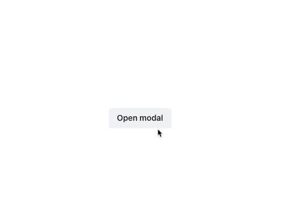
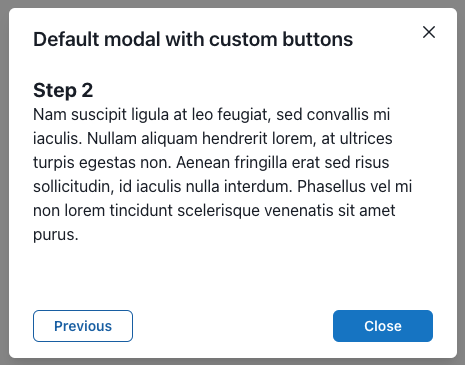
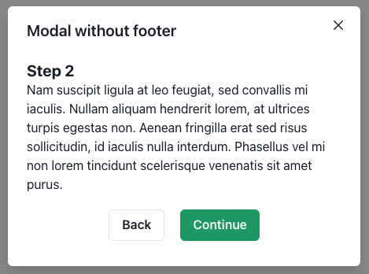

# Chakra UI MultiModal

[]()
[]()
[]()
[](https://github.com/prettier/prettier)
[](LICENSE.md)

This component is a wrapper for a basic [Chakra's Modal](https://chakra-ui.com/docs/components/modal) component. It provides its own Context along with Section and (optional) Footer components for switching content inside one opened Modal.

<div align='center'>
  
</div>

> This version (1.x) of MultiModal was created for Chakra UI v2. MultiModal wasn't tested for previous Chakra's versions.

## Contents

- [Usage](#usage)
- [Components](#included-components)
  - [`MultiModal`](#multimodal)
  - [`MultiModalSection`](#multimodalsection)
  - [`MultiModalFooter`](#multimodalfooter)
- [Hook useMultiModal](#hook-usemultimodal)
- [Additional screenshots](#additional-screenshots)
- [Contributing](#contributing)

## Usage

In order to use this package, you'll need to have `@chakra-ui/react@2` set up like in [their docs](https://chakra-ui.com/getting-started)

Then install this package:

```bash
npm i chakra-multi-modal
# or
yarn add chakra-multi-modal
# or
pnpm add chakra-multi-modal
```

Once installed, you can replace Modal with MultiModal and add your sections to it:

```tsx
const modalProps = useDisclosure();

return (
  <MultiModal sections={[<FirstSection />, <SecondSection />]} {...modalProps}>
    <ModalOverlay />
    <ModalContent>
      <ModalHeader>Title</ModalHeader>
      <ModalCloseButton />
      <MultiModalSection />
      <MultiModalFooter />
    </ModalContent>
  </MultiModal>
);
```

## Components

### `MultiModal`

Replaces with `Modal` component

| Extra Prop | Type           | Description                                                    |
| ---------- | -------------- | -------------------------------------------------------------- |
| `sections` | ReactElement[] | Takes all sections that should be displayed in the multi modal |

### `MultiModalSection`

This component is **required** and should be replaced with `ModalBody` component. Takes all `ModalBody's` props excluding `children`.

### `MultiModalFooter`

Optional component. Replaces `ModalFooter` and adds buttons for switching sections. Doesn't include `children`.

| Extra Prop            | Type        | Description                   |
| --------------------- | ----------- | ----------------------------- |
| `nextButtonProps`     | ButtonProps | Props for 'Next/Close' button |
| `previousButtonProps` | ButtonProps | Props for 'Previous' button   |

## Hook useMultiModal

If default MultiModalFooter doesn't meet your requirements you can remove it and build your own Footer or even add switching buttons to each section.

| Name             | Type         | Description                                           |
| ---------------- | ------------ | ----------------------------------------------------- |
| `currentSection` | ReactElement | Returns current section                               |
| `isFirstSection` | boolean      | Indicates if the current section is the first section |
| `isLastSection`  | boolean      | Indicates if the current section is the last section  |
| `next`           | func         | Switches to the next section                          |
| `previous`       | func         | Switches to the previous section                      |
| `reset`          | func         | Switches to the first section                         |
| `close`          | func         | Closes modal                                          |

## Additional screenshots

<div align='center'>
  
  <p>Custom styles of MultiModalFooter's buttons</p>
</div>

---

<div align='center'>
  
  <p>Custom buttons in section</p>
</div>

## Contributing

Found a bug? Do you see something that can be done better? Feel free to open an issue or fork this repo and open a Pull Request. Please read [Contribution Doc](docs/contributing.md) before contributing.
